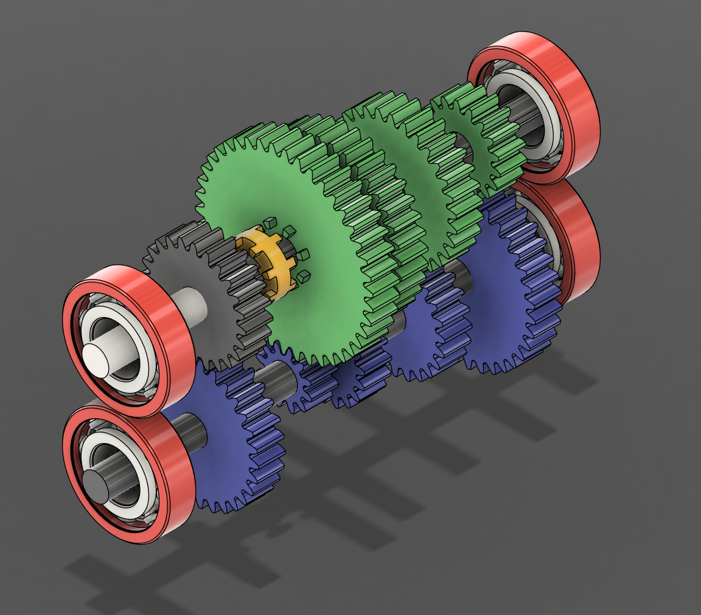
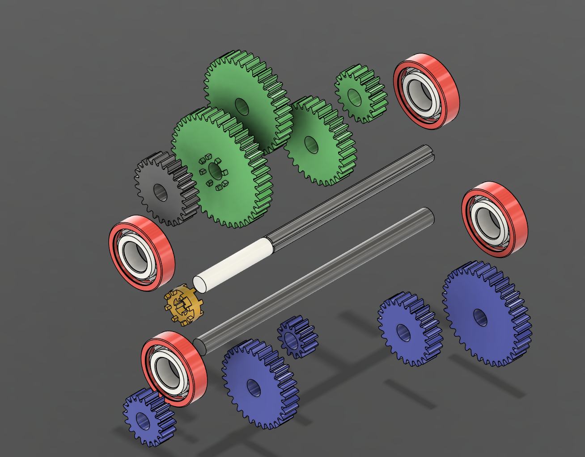

# Constant Mesh Gearbox – Fusion 360 Project

## 🔧 Project Overview
This project involves the complete modeling, assembly, and animation of a **Constant Mesh Gearbox** in Fusion 360. Inspired by the [YouTube tutorial](https://www.youtube.com/watch?v=rPDsY4FN2Y0), this design showcases key CAD skills like part modeling, gear alignment, mechanical joints, and motion animation.

## 🛠 Tools Used
- Fusion 360 (Design, Assembly, Animation)
- Spur Gear Add-In
- Exploded View & Motion Study

## 📂 Project Structure
| Folder | Contents |
|--------|----------|
| `Fusion_Files` | full assembled parts (.f3d) |
| `Screenshots` | Rendered views, exploded views, and section captures |
| `Animation` | Video of gear motion and assembly |
| `Drawings` | 2D manufacturing drawings (PDF) |
| `ReadMe.md` | Project details and preview |

## 🧱 Components Modeled
- Spur Gears (Driver & Driven)
- Shafts with key slots
- Gearbox Housing
- Assembly with As-Built and Revolute Joints

## 📸 Preview

### Full Assembly

### Exploded View

### Motion Study (GIF)

## 🧠 Skills Demonstrated
- Parametric Modeling
- Multi-Body Assembly
- Joint Constraints and Motion Links
- Technical Drawing Export
- Project Organization for GitHub Portfolio

---

 *Note: All files are created for educational and portfolio purposes.*
